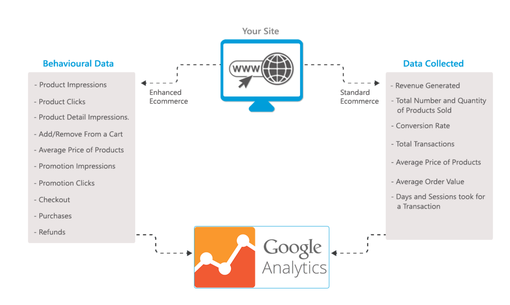
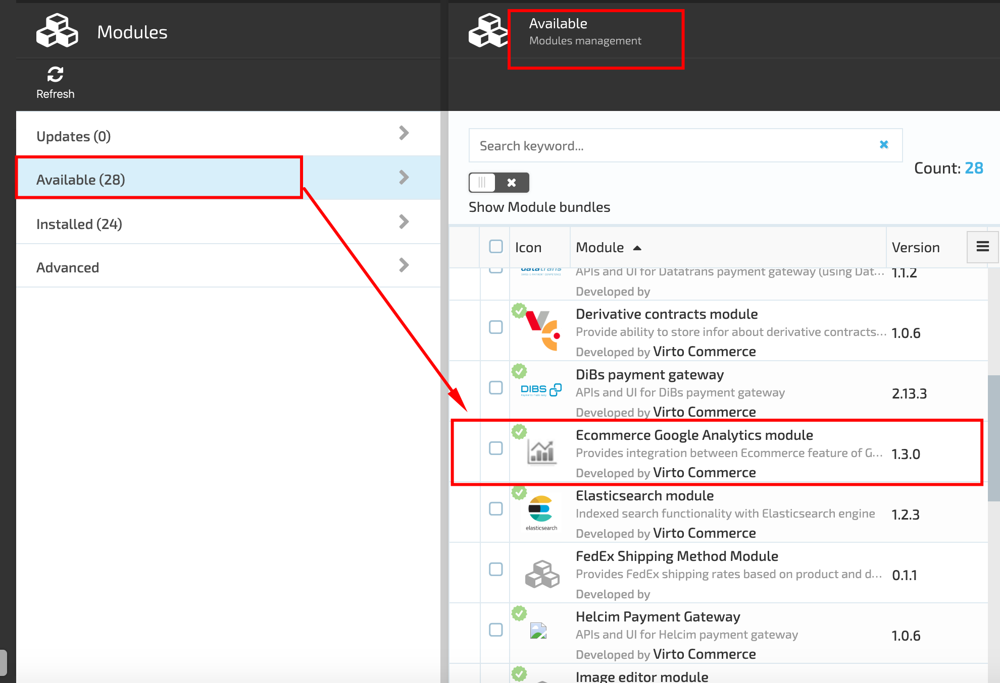
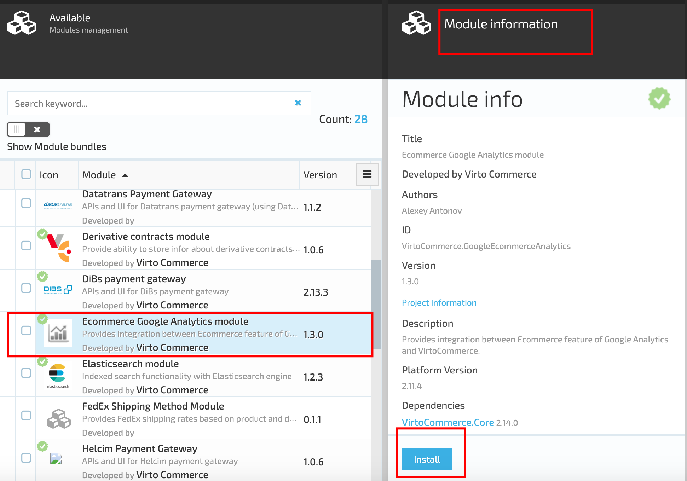
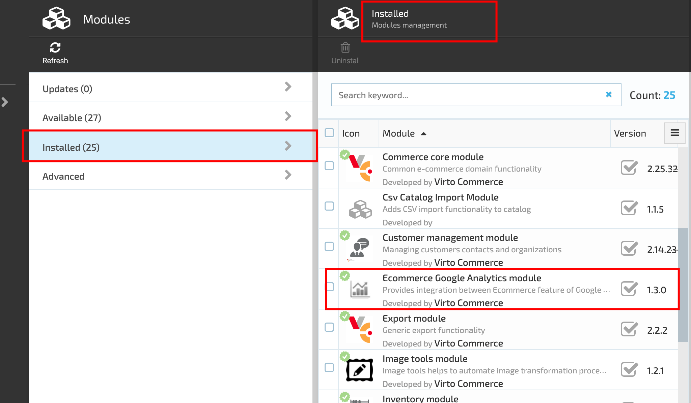

# Overview

Google Analytics offers two levels of detail in tracking ecommerce:

1. **Basic Ecommerce Tracking** that tracks only completed purchases;

1. **Enhanced Ecommerce Tracking** offers expanded tracking of user's interactions with products all through the site.

### Enhanced Ecommerce Tracking

Enhanced Ecommerce doesn't just let you monitor the performance of products and analyze the sales funnel; it also aims to provide you much deeper behavioral insights so you can optimize that funnel by enhancing the user experience as well as your marketing plans.

To assist developers in identifying the type of data they are looking to track, Google has grouped different data types into four categories. These categories let you identify what data you can track and the relevant values in a data layer that are captured based on a trigger.

#### These categories are:

**Impression data**: Provides complete information about a product that has been viewed by a customer.

**Product data**: Provides complete information about individual products that are viewed.

**Promotion data**: Provides complete information about the promotional elements/banners you have used on your website.

**Action data**: Provides complete information about all ecommerce actions happening on the website.

Check out the Google Analytics tracking [guide](https://developers.google.com/analytics/devguides/collection/analyticsjs/enhanced-ecommerce?hl=en) for a detailed list of all the individual data types that can be tracked under each of these categories.

## VC Google Ecommerce Analytics Module

Google Ecommerce Analytics module allows you to use the newly launched feature of Google Analytics – Enhanced Ecommerce. You can track the user behavior across your e-commerce store starting from product views to thank you page.

The module consists of two parts:

1. Google Analytics module itself;
1. Snippets that should be added to the theme if Google Analytics functionality is needed. The Snippet file allows measuring product impressions, view product details and purchases.

Google Ecommerce Analytics Module can measure the following data:

1. **Product impressions**. The impressions action is used to record impressions of products as users see them throughout the site;
1. **View product details**. The detail action represents viewing a product detail page;
1. **Purchase**.

## Features

1. Quick & Easy installation;
1. Supports Enhanced Ecommerce tracking with Google Tag Manager;
1. Measure Product Impressions;
1. Measure Views of Product Details;
1. Measure Purchases.

## Setup and installation

### Download Google Tag Manager Container File

Download the <a href="https://github.com/VirtoCommerce/vc-module-google-ecommerce-analytics/raw/master/VirtoCommerce.GoogleEcommerceAnalyticsModule.Web/Content/gtm-virtocommerce_v1.json">container JSON file</a>.

### Import JSON File into GTM
Log into your own <a href="http://www.google.com/tagmanager/">Google Tag Manager</a> container and head to the Admin section of the site. Under Container options, select Import Container.

### Update With Your Own Tracking ID
Update the Variable named {{GA Property ID}} with your Google Analytics Tracking ID.

### Preview & Publish
Use the Preview options to test this container on your own site. Try testing each of the events to make sure they’re working properly. If everything looks good, go ahead and publish!

## Module Installation

### Automatic Installation

 In VC Manager go to More -> Modules -> Ecommerce Google Analytics module -> Install

### Manual Installation

 Download module zip package from https://github.com/VirtoCommerce/vc-module-google-ecommerce-analytics/releases. 

### Advanced Installation

In VC Manager go to More -> Modules -> Advanced -> upload module package -> Install.

### Download Liquid snippet file

Download the snippet file <a href="https://raw.githubusercontent.com/VirtoCommerce/vc-module-google-ecommerce-analytics/master/VirtoCommerce.Storefront/App_Data/Themes/default/snippets/vc-google-ecommerce-analytics.liquid">vc-google-ecommerce-analytics.liquid</a> and copy it to snippet folder \VirtoCommerce.Storefront\App_Data\Themes\\{YourTheme}\snippets.

### Include snippet into your themes

Paste this code  into your themes so that it appears immediately after the opening \<body\> tag.

### Settings

In VC Manager go to More -> STORES -> {YourStore} -> Ecommerce Google Analytics. Enable the plugin and insert your Google Tag Manager Id.

### Finish

To verify the correct integration you can use the Chrome extension <a href="https://chrome.google.com/webstore/detail/tag-assistant-by-google/kejbdjndbnbjgmefkgdddjlbokphdefk">Tag Assistant</a> from Google. 